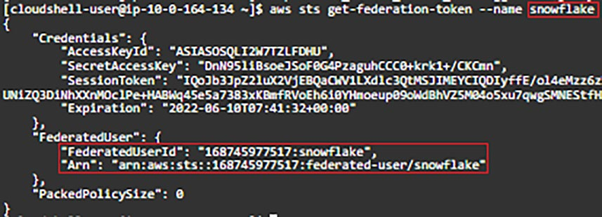

## Private Link

AWS PrivateLink is an AWS service for creating private VPC endpoints that allow direct, secure connectivity between your AWS VPCs and the Snowflake VPC without traversing the public Internet. The connectivity is for AWS VPCs in the same AWS region.
https://docs.snowflake.com/en/user-guide/admin-security-privatelink

## Steps to create Private Link:
This part relies on AWS-supplied policies for CloudShell (AWS CloudShellFullAccess) and for EC2 (AmazonEC2FullAccess). However, there is no AWS supplied policy for STS, so you must therefore create your own.

- Begin by searching within AWS console for IAM, select Policies, and then click Create Policy.
- In the policy Json box paste this json for STS policy.

## Steps Writedown
- Step-1 Create STS Profile
	- IAM, select Policies, and then click Create Policy.
	- In the policy Json box paste this json for STS policy.
	- Name the policy as snowflake_private_link_policy
```
{
    "Version": "2012-10-17",
    "Statement": [
        {
            "Sid": "STS",
            "Effect": "Allow",
            "Action": [
                "sts:AssumeRole",
                "sts:GetFederationToken"
            ],
            "Resource": "*"
        }
    ]
}	
```
- Step-2 Creating IAM User, snowflake_private_link_user
	- Allow Programmatic access and AWS management console access.
	- In the permission assign following permissions
	- `AWSCLousShellFullAccess`, `AmazonEC2FullAccess`, `snowflake_private_link_policy` 
	- In the permission tab apply snowflake_private_link_policy

- Step-3 Getting Federation Token 
	- Start CloudShell and in bash shell 
	- export AWS_ACCESS_KEY_ID=<Your Access Key Here>
	- export AWS_SECRET_ACCESS_KEY=<Your Secret Access Key Here>
	- aws sts get-federation-token --name snowflake
  
	

- Step-4 Verify Private Link
	- Verify private link in Snowflake using above information
    - `USE ROLE accountadmin;`

```SQL
	SELECT system$get_privatelink(
       '<Your AWS Account ID Here>',
       '{
           "Credentials": {
               "AccessKeyId": "<Your Access Key Here>",
               "SecretAccessKey": "<Your Secret Access Key Here>",
               "SessionToken": "<Your Session Token Here>",
               "Expiration": "<Your Expiry Time Here>"
           },
           "FederatedUser": {
               "FederatedUserId": "<Your AWS Account ID Here>:snowflake",
               "Arn": "arn:aws:sts:: <Your AWS Account ID Here>:federated-user/snowflake"
           },
           "PackedPolicySize": 0
       }' );
```

- Step-5 Authorize Private Link:
	- First authorize the private link before accessing it
	- `USE ROLE accountadmin;`
```SQL
	SELECT system$authorize_privatelink(
       '<Your AWS Account ID Here>',
       '{
           "Credentials": {
               "AccessKeyId": "<Your Access Key Here>",
               "SecretAccessKey": "<Your Secret Access Key Here>",
               "SessionToken": "<Your Session Token Here>",
               "Expiration": "<Your Expiry Time Here>"
           },
          "FederatedUser": {
              "FederatedUserId": "<Your AWS Account ID Here>:snowflake",
              "Arn": "arn:aws:sts:: <Your AWS Account ID Here>:federated-
user/snowflake"
          },
          "PackedPolicySize": 0
      }' );

```
- Step-5 Revoke Private Link:
	- To revoke the private link run this. 
	- `USE ROLE accountadmin;`
```SQL
	SELECT system$revoke_privatelink(
       '<Your AWS Account ID Here>',
       '{
           "Credentials": {
               "AccessKeyId": "<Your Access Key Here>",
               "SecretAccessKey": "<Your Secret Access Key Here>",
               "SessionToken": "<Your Session Token Here>",
               "Expiration": "<Your Expiry Time Here>"
           },
          "FederatedUser": {
              "FederatedUserId": "<Your AWS Account ID Here>:snowflake",
              "Arn": "arn:aws:sts:: <Your AWS Account ID Here>:federated-
user/snowflake"
          },
          "PackedPolicySize": 0
      }' );

```
- Step-6 Indentifying Private Link End Points:
	- To revoke the private link run this. 
	- `SELECT system$get_privatelink_authorized_endpoints();`
```
	SELECT REPLACE ( value:endpointId,     '"' ) AS AccountID,
		   REPLACE ( value:endpointIdType, '"' ) AS CSP
	FROM TABLE (FLATTEN (input => parse_json(system$get_privatelink_authorized_endpoints())));
```

You might also consider adding PrivateLink endpoint identification to your security
monitoring to ensure no unauthorized endpoints have been added to your system
configuration, noting the endpoints can be either AWS or Azure with GCP to follow:


## SSO over Private Link
SSO may be enabled for either public Internet access or for PrivateLink access. It is not
possible to enable SSO for both public Internet access and PrivateLink access at the
same time.
