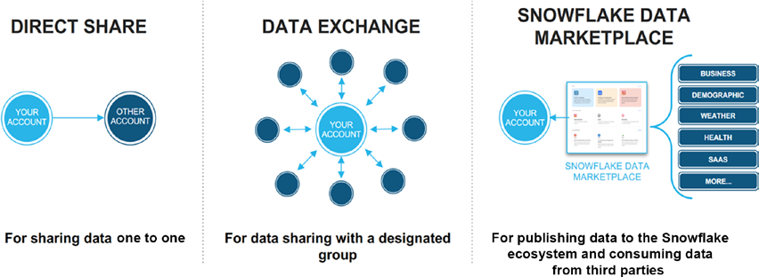
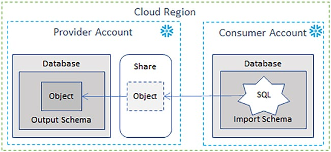
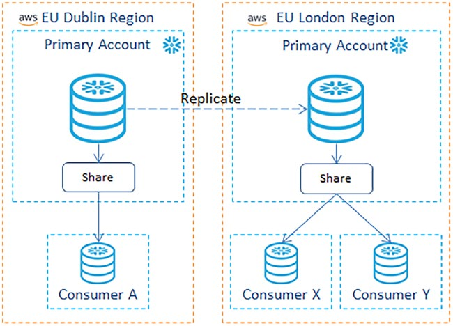

These object types are sharable:
- Tables
- External tables
- Secure views
- Secure materialized views
- Secure UDFs

Data Sharing Options:
1. Same Region and Same CSP: When Snowflake accounts are colocated within the same region and CSP, Secure
Direct Data Share (SDDS) may be used to deliver both data and functionality,

2. Different Region or Different CSP: When Snowflake accounts are located within the different regions or CSPs, you must first
replicate before Secure Direct Data Share may be used to deliver data and functionality

