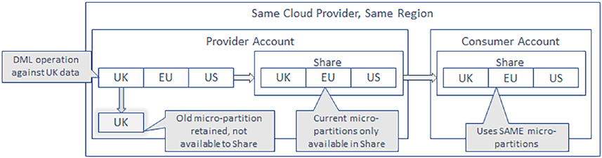
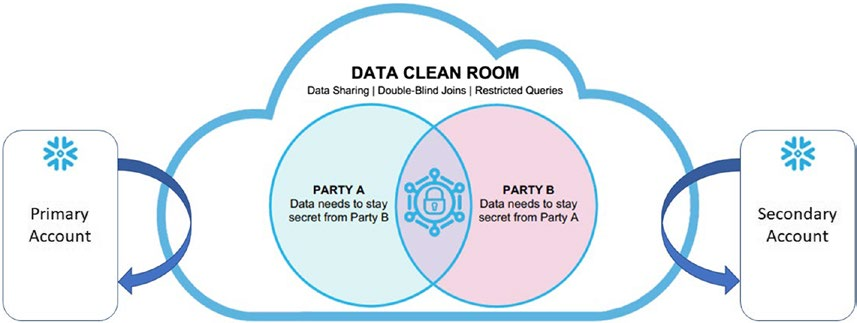

These object types are sharable:
- Tables
- External tables
- Secure views
- Secure materialized views
- Secure UDFs

Data Sharing Options:
## Same Region and Same CSP: 
When Snowflake accounts are colocated within the same region and CSP, Secure 
Direct Data Share (SDDS) may be used to deliver both data and functionality,

## Different Region or Different CSP: 
When Snowflake accounts are located within the different regions or CSPs, you must first
replicate before Secure Direct Data Share may be used to deliver data and functionality

## Data Sharing Under the Hood:
The image below shows how micro-partitions are shared from the Provider account to the Consuming account, noting only the current micro-­
partitions are available to the consuming share. The net effect of data sharing is that all
changes to data made by the provider are immediately available to the consumer, yes, in real time!

Data Sharing Monitoring

Private Listing

## Data Clean Rooms
DCRs enable organizations to interact within strictly controlled and totally isolated
environments. With a full understanding of the data sharing options explained earlier
in this chapter, you can quickly grasp the concept of a bidirectional data share. DCRs
implement both producer and consumer functionality within two Snowflake accounts,
one for your organization (which we deem to be the primary) and one for your customer
(which we deem to be the secondary). In real-world use, there may be more than one
secondary account participating in a DCR, but to keep the explanation simple, we only
consider two participants for now.

