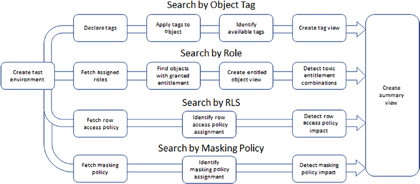

- Who can see what? Roles, objects, and attributes accessible by a user
- Who can do what? Roles and objects a user can manipulate
- Who has seen what? The historical evidence of data access
- Who has done what? The historical evidence of object manipulation

PII Data: Masking

## Toxic Entitlement Combinations
USE SECONDARY ROLES ALL;
USE SECONDARY ROLES NONE;

## Object Tag Propagation
Tags applied to the employee table are not inherited by the view v_employee by default.
This behavior is explicitly called out within the Snowflake documentation found here:
https://docs.snowflake.com/en/user-guide/object-tagging.html#tag-lineage

You must therefore implement manual deployment of tags on view v_employee to ensure consistency of tags to objects:

ALTER TABLE monitor.monitor_owner.v_employee
SET TAG PII = 'Personally Identifiable Information';
ALTER TABLE monitor.monitor_owner.v_employee
MODIFY COLUMN preferred_name
SET TAG PII_S_Name = 'Personally Identifiable Information -> Sensitive
-> Name';
ALTER TABLE monitor.monitor_owner.v_employee
MODIFY COLUMN surname_preferred
SET TAG PII_S_Name = 'Personally Identifiable Information -> Sensitive
-> Name';
ALTER TABLE monitor.monitor_owner.v_employee
MODIFY COLUMN forename_preferred
SET TAG PII_S_Name = 'Personally Identifiable Information -> Sensitive
-> Name';
ALTER TABLE monitor.monitor_owner.v_employee
MODIFY COLUMN gender
SET TAG PII_N_Gender = 'Personally Identifiable Information -> Non-­
Sensitive -> Gender';

