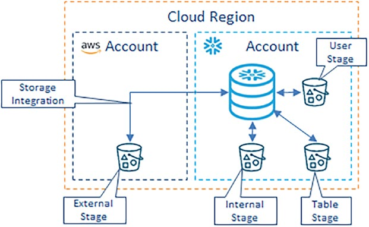

## Cost Drivers.
- Compute Cost: Pipes, Clustering, Usage (reader account), Warehouse
- Storage Cost: Tables, Internal Stages, Materialized Views
- Data Transfer Cost: Data Replication, External stages

## Identifying Consumption Metrics:
USE ROLE accountadmin;
SELECT current_account();

SELECT current_region()  AS current_region,
       current_account() AS current_account,
       service_type,
       usage_date,
       credits_billed,
       current_timestamp() AS extract_timestamp
FROM   snowflake.account_usage.metering_daily_history
ORDER BY service_type, usage_date DESC;

### Currently snowflake provides following cost reporting metrics.
- automatic_clustering_history
- database_storage_usage_history
- data_transfer_history
- materialized_view_refresh_history
- metering_daily_history
- pipe_usage_history
- replication_usage_history
- search_optimization_history
- stage_storage_usage_history
- warehouse_metering_history
