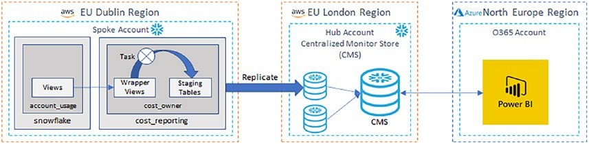

## Cost Drivers.
- Compute Cost: Pipes, Clustering, Usage (reader account), Warehouse
- Storage Cost: Tables, Internal Stages, Materialized Views
- Data Transfer Cost: Data Replication, External stages


## Identifying Consumption Metrics:
USE ROLE accountadmin;
SELECT current_account();

SELECT current_region()  AS current_region,
       current_account() AS current_account,
       service_type,
       usage_date,
       credits_billed,
       current_timestamp() AS extract_timestamp
FROM   snowflake.account_usage.metering_daily_history
ORDER BY service_type, usage_date DESC;


### Currently snowflake provides following cost reporting metrics.
- automatic_clustering_history
- database_storage_usage_history
- data_transfer_history
- materialized_view_refresh_history
- metering_daily_history
- pipe_usage_history
- replication_usage_history
- search_optimization_history
- stage_storage_usage_history
- warehouse_metering_history


# Steps followed here
1. CREATE OR REPLACE DATABASE cost_reporting DATA_RETENTION_TIME_IN_DAYS = 90;
2. CREATE SOURCE VIEW `CREATE OR REPLACE VIEW v_metering_daily_history COPY GRANTS AS`
   - FROM snowflake.account_usage.metering_daily_history;
3. CREATE STAGING TABLE `CREATE OR REPLACE TABLE stg_metering_daily_history`
4. ALTER TABLE TO ENABLE TRACKING BECAUSE LATER NEED TO CREATE STREAM FROM THIS TABLE.
   - ALTER TABLE stg_metering_daily_history SET change_tracking = TRUE;
5. INSERT OVERWRITE INTO cost_reporting.cost_owner.stg_metering_daily_history
6. CREATE A TASK FOR REGULAR INSERT:
   - ```
       CREATE OR REPLACE TASK cost_reporting.cost_owner.task_metering_
       daily_history
       USER_TASK_MANAGED_INITIAL_WAREHOUSE_SIZE = XSMALL
       SCHEDULE = '5 MINUTE'
       AS
       INSERT OVERWRITE INTO cost_reporting.cost_owner.stg_metering_daily_history ... 
     ```
7. START THE TASK `ALTER TASK cost_reporting.cost_owner.task_metering_daily_history RESUME;`





1. REPLICATE ABOVE DATABASE TO CMS ACCOUNT
2. ALTER DATABASE cost_reporting ENABLE REPLICATION TO ACCOUNTS NUYMCLU.NP62160;
3. SHOW REPLICATION DATABASES;
4. INGESTING REPLICATED DATABASES
   - ```
      USE ROLE accountadmin;
      CREATE DATABASE nuymclu_replication_tertiary_cost_reporting AS REPLICA OF nuymclu.replication_tertiary.cost_reporting
      DATA_RETENTION_TIME_IN_DAYS = 90;

       ```
5. REFRESH IMPORTED DATABASE: ALTER DATABASE nuymclu_replication_tertiary_cost_reporting REFRESH;
6. CREATE TASK TO REFRESH REPLICATED DATABASE: 
   - ```
     CREATE TASK nuymclu_replication_tertiary_cost_reporting_task
     WAREHOUSE            = compute_wh
     SCHEDULE             = 'USING CRON 0 8 * * * GMT'
     USER_TASK_TIMEOUT_MS = 14400000
     AS
     ALTER DATABASE nuymclu_replication_tertiary_cost_reporting REFRESH;
     ```
7. RESUME TASK: ALTER TASK nuymclu_replication_tertiary_cost_reporting_task RESUME;


1. CREATE TABLE: CREATE OR REPLACE TABLE cms_metering_daily_history
2. CREATE STREAM: 
   - ```
     CREATE STREAM strm_nuymclu_replication_tertiary_cost_reporting_metering_
     daily_history
     ON TABLE nuymclu_replication_tertiary_cost_reporting.cost_owner.stg_
     metering_daily_history;
     ```
3. CREATE A TASK THAT IS TRIGGERED BY PRESENCE OF NEW DATA IN THE STG TABLE
   - ```
      CREATE OR REPLACE TASK task_load_nuymclu_replication_tertiary_cost_reporting_metering_daily_history
       WAREHOUSE = cms_wh
       SCHEDULE  = '5 minute'
       WHEN system$stream_has_data ( 'strm_nuymclu_replication_tertiary_cost_reporting_metering_daily_history' )
       AS
       INSERT INTO cms_metering_daily_history
       SELECT 'nuymclu_replication_tertiary_cost_reporting_metering_daily_history'
      ```

4. SELECT * FROM cms_metering_daily_history;
5. CREATE A VIEW 
   - ```
     CREATE OR REPLACE VIEW v_cms_monthly_metering_daily_history 
     AS
       SELECT spoke_name,
       current_region()  AS current_region,
       current_account() AS current_account,
       service_type,
       DECODE ( EXTRACT ( 'month', usage_date ),
                          1,  'January',
                          2,  'February',
                          3,  'March',
                          4,  'April',
                          5,  'May',
                          6,  'June',
                          7,  'July',
                          8,  'August',
                          9,  'September',
                          10, 'October',
                          11, 'November',
                          12, 'December')  AS month_of_year,
       TO_CHAR ( DATE_PART ( 'year', usage_date ))   AS billing_year,
       SUM   ( credits_billed ) AS sum_credits_billed,
       current_timestamp()      AS extract_timestamp
       FROM   cms_metering_daily_history
       GROUP BY spoke_name,
         service_type,
         DATE_PART ( 'Month', usage_date ),
         DATE_PART ( 'year',  usage_date );
     ```
